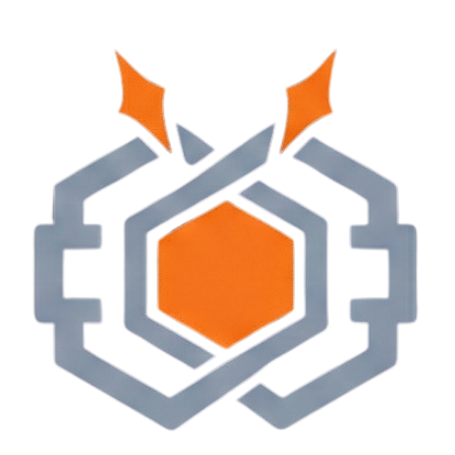

<p align="center">
  
</p>

# forge-orchestrator

**Multi-tool coordination in a single Rust binary.**

This is L2: Pro Builder.

Multi-agent inside a single tool works fine. Claude Code runs 20 subagents and they stay aligned because the tool manages that coordination internally. The problem is multi-tool: Claude Code, Codex CLI, and Gemini CLI on the same repo with no shared state. That's what the orchestrator solves.

It adds file locking, knowledge capture, task planning, drift detection, and multi-tool coordination to your development workflow. Three tools reading from and writing to a single state directory.

The orchestrator exists because I ran two AI tools on the same codebase and watched them fail in the same ways human teams fail. Claude refactored a module. Codex updated tests against the pre-refactor interface. Both saved. Tests failed. Neither tool knew the other existed. I'd spent 23 years watching this exact scenario with talented human teams. The solution was always the same: coordination infrastructure.

## Install

```bash
curl -fsSL https://forge.nxtg.ai/install.sh | sh
forge init
```

Single binary. 4MB. No runtime dependencies.

## What You Get

| Feature | What It Does |
|---------|-------------|
| File locking | Exclusive locks prevent tools from editing the same file simultaneously |
| Knowledge flywheel | Captures decisions, patterns, learnings across tools. Auto-classified and searchable. |
| Plan generation | `forge plan --generate` decomposes specs into dependency-aware task graphs |
| Drift detection | Compares in-progress work against specs, flags divergence early |
| Task board | Dependency-tracked tasks, tool assignment, progress monitoring |
| Multi-tool adapters | Claude Code (MCP stdio) + Codex CLI + Gemini CLI (filesystem) |
| TUI dashboard | `forge dashboard`: live tool panes, task status, lock state |
| Headless mode | `forge run`: autonomous execution for CI/CD pipelines |
| MCP server | 10 tools accessible by any connected AI tool |

## Key Commands

```bash
forge init                     # Initialize Forge in a project
forge plan --generate          # Generate task plan from spec
forge dashboard                # Live TUI dashboard
forge run                      # Headless autonomous mode
forge status                   # Current state summary
```

## Architecture

The orchestrator is the policy core of Forge. All governance rules, file locks, and coordination logic live here. The plugin (L1: Vibe Coder) and UI (L3: Ship Lord) are adapter surfaces. They present the orchestrator's state through different interfaces but don't make policy decisions.

```
┌──────────────────────────────────────┐
│        forge-orchestrator            │
│        (Rust, 4MB, 292 tests)        │
│                                      │
│  File locking · Task planning        │
│  Knowledge · Governance · MCP        │
│  Multi-tool adapters                 │
│                                      │
│  Policy enforced here.               │
│  Nowhere else.                       │
└───────────┬──────────────────┬───────┘
            │                  │
   ┌────────┴────────┐  ┌────┴────────┐
   │  forge-plugin   │  │  forge-ui   │
   │  (L1 Safety)    │  │  (L3 MC)    │
   │  Claude Code    │  │  React      │
   │  adapter        │  │  dashboard  │
   └─────────────────┘  └─────────────┘
```

**Communication**: `.forge/` filesystem + MCP stdio. No daemon. No database. State is files.

**Tool adapters**: Claude Code uses MCP stdio. Codex CLI and Gemini CLI use filesystem conventions. Each tool reads its own config format. No Forge-specific configuration language.

## How File Locking Works

File locking exists because I've watched teams lose days to conflicting edits.

When Claude Code starts editing a file, the orchestrator acquires an exclusive lock in `.forge/locks/`. Codex CLI requesting the same file is queued with a notification of who holds the lock. Locks include timeouts (crashed tools don't hold locks forever) and deadlock detection.

292 tests cover concurrent access, timeout behavior, multi-adapter locking, and edge cases.

## How the Knowledge Flywheel Works

The knowledge flywheel exists because I've watched decisions evaporate between sprints.

Every decision, pattern, and learning from tool sessions is captured in `.forge/knowledge/`. Entries are auto-classified by category. Search across sessions and across tools. Knowledge captured during a Claude Code session is available to Codex CLI the next day.

After a week, the system knows your conventions better than you remember them. New sessions start with context instead of from scratch.

## Upgrade Path

For visual dashboards and the Infinity Terminal (sessions that survive browser close, network drops, and server restarts), add Forge UI:

```bash
git clone https://github.com/nxtg-ai/forge-ui && npm install && npm run dev
```

58 components. 4,146 tests. 87% coverage.

## Links

- [Forge Product Page](https://forge.nxtg.ai)
- [Forge Plugin](https://github.com/nxtg-ai/forge-plugin) (L1: Vibe Coder)
- [Forge UI](https://github.com/nxtg-ai/forge-ui) (L3: Ship Lord)
- [Documentation](https://forge.nxtg.ai/docs)

## License

See [LICENSE](./LICENSE).
