<div align="center">

<picture>
  <source media="(prefers-color-scheme: dark)" srcset="assets/banner.svg">
  <source media="(prefers-color-scheme: light)" srcset="assets/banner.svg">
  
</picture>

<br/>

**The tech lead that never sleeps.**

Plan work. Assign it to the right AI. Track progress. Prevent conflicts. Capture knowledge. Ship faster.

<br/>

[](https://opensource.org/licenses/MIT)
[](https://www.rust-lang.org/)
[](#)
[](#mcp-server)
[](#)
[](#)
[](https://github.com/nxtg-ai/forge-orchestrator/pulls)

[Quick Start](#quick-start) | [Why Forge?](#why-forge) | [MCP Server](#mcp-server) | [Architecture](#architecture) | [Contributing](#contributing)

</div>

---

## The Problem

You have Claude Code, Codex CLI, and Gemini CLI installed. They're powerful alone. But when two AI tools edit the same file? Chaos. When nobody remembers why a decision was made last Tuesday? Lost knowledge. When your spec says "build auth" but the AI is refactoring CSS? Drift.

**Forge coordinates your AI tools like a senior tech lead coordinates junior developers.**

## Why Forge?

| Without Forge | With Forge |
|:---|:---|
| AI tools step on each other's files | File locking prevents conflicts automatically |
| "What did we decide about auth?" | Knowledge flywheel captures every decision |
| Manually copy-pasting tasks between tools | One plan, auto-assigned to the best AI tool |
| No idea if work matches the spec | Drift detection catches misalignment early |
| Each AI tool is an island | Unified state via MCP — all tools see the same board |

## Install

**One-liner (Linux/macOS):**

```bash
curl -sSL https://raw.githubusercontent.com/nxtg-ai/forge-orchestrator/main/install.sh | sh
```

**Windows (PowerShell):**

Download from [latest release](https://github.com/nxtg-ai/forge-orchestrator/releases/latest), extract `forge.exe`, and add to PATH.

**From source (any platform with Rust):**

```bash
git clone https://github.com/nxtg-ai/forge-orchestrator.git
cd forge-orchestrator
cargo install --path .
```

## Quick Start

```bash
# 1. Initialize in any project (must be a git repo)
cd your-project
forge init

# 2. Write a SPEC.md describing what you want to build

# 3. Generate a plan from your spec
forge plan --generate        # AI decomposes spec into tasks with dependencies

# 4. See the task board
forge status                 # Full task table with deps, statuses, agents

# 5. Launch the TUI dashboard (recommended)
forge dashboard              # Live multi-agent orchestration with real-time output

# Or run headlessly (CI/CD, SSH, scripting)
forge run                    # Parallel autonomous execution, no TUI
forge run --dry-run           # Preview execution plan without running
forge run --parallel 1        # Sequential mode

# Or run a single task manually
forge run --task T-001 --agent codex
```

### 30-Second Setup with Claude Code

Add to your project's `.mcp.json`:

```json
{
  "mcpServers": {
    "forge": {
      "type": "stdio",
      "command": "forge",
      "args": ["mcp", "--project", "."]
    }
  }
}
```

Restart Claude Code. Now Claude can call `forge_get_tasks()`, `forge_claim_task()`, `forge_check_drift()` — all 10 tools are native.

## How It Works

```
You write SPEC.md
        │
        ▼
┌──────────────────┐      ┌─────────────────┐
│  forge plan      │────▶│  ForgeBrain     │  GPT-4.1 decomposes spec
│  --generate      │      │ (pluggable LLM) │  into tasks with deps
└──────────────────┘      └─────────────────┘
        │
        ▼
┌──────────────────┐      ┌─────────────────┐
│  forge dashboard │────▶│  Adapters       │  Claude, Codex, Gemini
│  (TUI) or        │      │ (tool-specific) │  run in parallel with
│  forge run       │      │                 │  dependency scheduling
│  (headless)      │      │                 │  + rate limit backoff
└──────────────────┘      └─────────────────┘
        │
        ▼
┌──────────────────┐      ┌─────────────────┐
│  Auto-commit per │◀───▶│  .forge/        │  File-based state
│  task + status   │      │  state.json     │  MCP live queries
│  forge mcp       │      │  tasks/ events/ │  Knowledge flywheel
└──────────────────┘      └─────────────────┘
```

## CLI Commands

| Command | What It Does |
|:--------|:-------------|
| `forge init` | Scan project, detect AI tools, scaffold `.forge/` |
| `forge plan --generate` | Decompose SPEC.md into tasks using ForgeBrain |
| `forge status` | Full task table with deps, blocking status, agents |
| `forge dashboard` | **TUI dashboard** — live multi-agent orchestration with scrollable panes, shell access, auto-commit |
| `forge run` | **Headless autonomous mode** — parallel dependency-aware execution for CI/CD |
| `forge run --dry-run` | Preview execution plan without running |
| `forge run --task T-001 --agent claude` | Execute a single task |
| `forge start` | Sequential orchestration with retry logic |
| `forge sync` | Reconcile state, render CLAUDE.md/AGENTS.md/GEMINI.md |
| `forge config brain openai` | Switch to OpenAI-powered brain |
| `forge mcp` | Start MCP server (stdio) for AI tool integration |

## MCP Server

Forge includes a built-in [Model Context Protocol](https://modelcontextprotocol.io) server. Any MCP-compatible AI tool can query and update orchestration state in real-time.

### 10 Tools

| Tool | Description |
|:-----|:------------|
| `forge_get_tasks` | List/filter tasks by status, assignments, dependencies |
| `forge_claim_task` | Claim a task — locks associated files, prevents conflicts |
| `forge_complete_task` | Mark done — unlocks files, reveals newly available tasks |
| `forge_get_state` | Full state: project info, tools, brain config, active locks |
| `forge_get_plan` | Read the master plan |
| `forge_capture_knowledge` | Store a learning, decision, or pattern (auto-classified) |
| `forge_get_knowledge` | Search the knowledge base, generate SKILL.md files |
| `forge_check_drift` | Compare completed work against SPEC.md vision |
| `forge_get_health` | 5-dimension governance health check (0-100 score) |
| `forge_set_project` | Switch the active project root for multi-project setups |

### Connecting AI Tools

<details>
<summary><b>Claude Code</b></summary>

Add to `.mcp.json` in your project root:

```json
{
  "mcpServers": {
    "forge": {
      "type": "stdio",
      "command": "forge",
      "args": ["mcp", "--project", "."]
    }
  }
}
```

Claude Code auto-discovers the tools. No plugin needed.
</details>

<details>
<summary><b>Codex CLI</b></summary>

Forge generates an `AGENTS.md` file that Codex CLI reads:

```bash
forge sync  # renders AGENTS.md with current tasks and state
codex --agents-md AGENTS.md
```
</details>

<details>
<summary><b>Gemini CLI</b></summary>

Forge generates a `GEMINI.md` context file:

```bash
forge sync  # renders GEMINI.md
gemini --context GEMINI.md
```
</details>

## Architecture

```
┌─────────────────────────────────────────────────────────────┐
│  CLI (clap)                                                 │
│  init | plan | dashboard | run | start | status | sync | mcp│
├─────────────────────────────────────────────────────────────┤
│  TUI Dashboard (ratatui + crossterm)                        │
│  Task board | Agent panes | Shell panes | Event log         │
│  Rate limit backoff | Auto-commit | Key legend              │
├─────────────────────────────────────────────────────────────┤
│  ForgeBrain (pluggable)                                     │
│  RuleBasedBrain (free) | OpenAIBrain (gpt-4.1) | ...        │
├─────────────────────────────────────────────────────────────┤
│  Core Engine                                                │
│  TaskManager | StateManager | EventLogger | PlanManager     │
│  KnowledgeManager | GovernanceChecker                       │
├─────────────────────────────────────────────────────────────┤
│  MCP Server (JSON-RPC 2.0 / stdio)                          │
│  10 tools for real-time AI-tool integration                 │
├─────────────────────────────────────────────────────────────┤
│  Adapters                                                   │
│  ClaudeAdapter | CodexAdapter | GeminiAdapter               │
├─────────────────────────────────────────────────────────────┤
│  .forge/ (file-based state)                                 │
│  state.json | tasks/ | knowledge/ | events.jsonl | plan.md  │
└─────────────────────────────────────────────────────────────┘
```

### Dual Engine Design

Forge separates **deterministic operations** (state, locks, events) from **intelligent decisions** (plan decomposition, drift detection). The deterministic engine runs zero LLM tokens. The brain is pluggable.

| Brain | Cost | Best For |
|:------|:-----|:---------|
| `RuleBasedBrain` | Free | Keyword heuristics, offline use |
| `OpenAIBrain` | Paid | Intelligent plan decomposition, drift detection |

Configure with:

```bash
forge config brain openai
forge config brain.model gpt-4.1    # or gpt-5, gpt-5.3-codex
```

Requires `OPENAI_API_KEY` in environment or `.env` file.

### File Locking

When an agent claims a task, Forge locks the associated files in `state.json`. Other agents see the conflict before starting work. Locks are released automatically on task completion.

```
Agent A claims T-001 → locks: src/auth.rs, src/middleware.rs
Agent B claims T-002 → checks locks → no conflict → proceeds
Agent C claims T-003 → checks locks → CONFLICT on src/auth.rs → blocked
```

### Knowledge Flywheel

Every interaction can generate intelligence. Forge captures and classifies it automatically:

```
forge_capture_knowledge("JWT tokens expire after 24h", source: "debugging")
  → auto-classified as "learning"
  → stored in .forge/knowledge/learnings/
  → searchable via forge_get_knowledge
  → aggregated into SKILL.md files
```

### Governance

The `forge_get_health` tool runs a 5-dimension check:

| Dimension | What It Checks |
|:----------|:---------------|
| Documentation | SPEC.md exists, README present, plan freshness |
| Architecture | `.forge/` integrity, state.json valid, no orphaned locks |
| Task Health | Stale tasks, broken dependencies, failed count, progress |
| Knowledge | Category coverage, SKILL.md generation status |
| Drift | Vision alignment score (0.0-1.0) via ForgeBrain |

Returns a **health score out of 100** with actionable findings.

## `.forge/` Directory

```
.forge/
├── state.json              # Project state, tool inventory, brain config, file locks
├── plan.md                 # Master plan (human-readable)
├── events.jsonl            # Append-only event log
├── tasks/
│   ├── T-001.json          # Task definitions with deps, acceptance criteria
│   └── T-001.md            # Human-readable task cards
├── results/                # Agent execution results
└── knowledge/
    ├── decisions/          # Architectural decisions (ADRs)
    ├── learnings/          # Lessons learned
    ├── research/           # Research findings
    └── patterns/           # Discovered patterns
```

## Comparison

| Tool | What It Does | What Forge Does Differently |
|:-----|:-------------|:---------------------------|
| [Claude Squad](https://github.com/smtg-ai/claude-squad) | Manages Claude terminals | Orchestrates ALL AI tools, not just Claude |
| [Claude-Flow](https://github.com/ruvnet/claude-flow) | Multi-agent Claude orchestration | Vendor-neutral, not Claude-locked |
| [Codex CLI](https://github.com/openai/codex) | Headless code execution | Coordinates Codex WITH other tools |
| [CCManager](https://github.com/ccmanager) | Session management | Task-level orchestration, not sessions |

**Forge doesn't replace your AI tools. It makes them work together.**

## Stats

| Metric | Value |
|:-------|:------|
| Language | Rust (2024 edition) |
| Binary size | 4.0 MB (includes TLS) |
| Source lines | ~10,650 |
| Tests | 293 (271 unit + 10 CLI + 12 MCP) |
| External runtime deps | Zero (single binary) |
| MCP tools | 10 |
| Supported AI tools | Claude Code, Codex CLI, Gemini CLI |

## Development

```bash
# Clone
git clone https://github.com/nxtg-ai/forge-orchestrator.git
cd forge-orchestrator

# Build
cargo build

# Test
cargo test

# Build release (~3 MB binary)
cargo build --release

# Run
./target/release/forge --help
```

### Project Structure

```
src/
├── main.rs              # Entry point, CLI dispatch
├── cli/                 # Command implementations
│   ├── init.rs          # Project initialization
│   ├── plan.rs          # Plan generation (uses ForgeBrain)
│   ├── dashboard.rs     # TUI dashboard launcher
│   ├── start.rs         # Sequential orchestration with retry
│   ├── run.rs           # Headless autonomous + single-task execution
│   ├── status.rs        # Full task table with dependencies
│   ├── sync.rs          # State reconciliation
│   └── config.rs        # Brain configuration
├── tui/                 # Terminal UI (ratatui + crossterm)
│   ├── app.rs           # Dashboard state, scheduler, key handling
│   ├── ui.rs            # Layout rendering (task board, agent panes, event log)
│   └── event.rs         # Terminal event polling
├── core/                # Core engine
│   ├── state.rs         # State management (.forge/state.json)
│   ├── task.rs          # Task lifecycle, file locking
│   ├── event.rs         # Event logging
│   ├── plan.rs          # Plan parsing and templates
│   ├── knowledge.rs     # Knowledge capture and retrieval
│   └── governance.rs    # Health checks, drift detection
├── brain/               # Pluggable LLM backends
│   ├── rule_based.rs    # Free heuristic brain
│   └── openai.rs        # Real OpenAI API integration
├── adapters/            # AI tool adapters
│   ├── claude.rs        # Claude Code adapter
│   ├── codex.rs         # Codex CLI adapter
│   └── gemini.rs        # Gemini CLI adapter
├── mcp/                 # MCP server
│   ├── server.rs        # JSON-RPC 2.0 dispatcher
│   ├── protocol.rs      # MCP protocol types
│   └── tools.rs         # 10 tool implementations
└── detect/              # AI tool auto-detection
    └── mod.rs
```

## Ecosystem

Forge is three repos that work together:

| Repo | What it is |
|:-----|:-----------|
| **[forge-orchestrator](https://github.com/nxtg-ai/forge-orchestrator)** (this repo) | Rust CLI &mdash; multi-agent task planning and coordination |
| **[forge-plugin](https://github.com/nxtg-ai/forge-plugin)** | Claude Code plugin &mdash; 21 commands, 22 agents, 29 skills, 6 hooks |
| **[forge](https://github.com/nxtg-ai/forge)** | Full platform &mdash; React dashboard, Infinity Terminal, API server |

The **orchestrator** plans and coordinates. The **plugin** adds governance to Claude Code. The **dashboard** adds visual oversight for teams.

> **Evaluating Forge?** See the [UAT Guide](https://github.com/nxtg-ai/forge-orchestrator/blob/main/UAT-Guide.md) for a guided walkthrough.

## Contributing

Forge is MIT-licensed and contributions are welcome.

**Good first issues:**
- Add a `ClaudeBrain` implementation (Claude API for plan decomposition)
- Add `forge worktree` command (git worktree per task for parallel agent isolation)
- Add `forge report` command (session summary from events.jsonl)
- Embedded interactive agent TUIs (PTY bridge per pane — "Stargate" mode)

**Before submitting a PR:**

```bash
cargo test          # All 293 tests must pass
cargo clippy        # No warnings
cargo fmt --check   # Formatted
```

## License

MIT -- [LICENSE](LICENSE)

---

<div align="center">

Built by [NXTG.AI](https://nxtg.ai) with Claude Opus 4.6

**Star this repo if your AI tools deserve a tech lead.**

</div>

